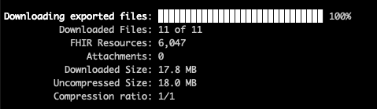

<p align="center">
  <h1 align="center">Bulk Data Export Client</h1>
<div align="center">


CLI application for FHIR Bulk Data Export and FHIR-based quality measure calculation using the HL7® FHIR® standard<sup id="fn-1">[\[1\]](#fnref-1)</sup>

</div>
</p>

---

# Table of Contents
- [Introduction](#introduction)
- [Installation](#installation)
  - [Prerequisites](#prerequisites)
  - [Local Installation](#local-installation)
  - [Local Usage](#local-usage)
- [Running the Client via the CLI](#running-the-client-via-the-cli)
- [Configuration](#configuration)
  - [Creating a Custom Configuration File](#creating-a-custom-configuration-file)
  - [CLI Options](#cli-options)
- [Three-Step Workflow](#three-step-workflow)
- [Dependent Open-Source Libraries](#dependent-open-source-libraries)
  - [FHIR Quality Measure (FQM) Execution](#fhir-quality-measure-fqm-execution)
  - [SMART on FHIR Bulk Data Client](#smart-on-fhir-bulk-data-client)
- [API Reference](#api-reference)
- [License](#license)

## Introduction
`bulk-data-export-client` is a reference implementation of a FHIR client that requests a bulk-data export from a server, receives status information regarding processing the requested files, and downloads the retrieved files. The capabilities of the client are restricted to Group-level data export.

Optionally, the client can perform calculation on FHIR-based Electronic Clinical Quality Measures (eCQMs) written in Clinical Quality Language (CQL) using the retrieved data from a successful bulk-data export operation. For more information on measure calculation, see the [fqm-execution](https://github.com/projecttacoma/fqm-execution) calculation library.

## Installation

### Prerequisites
- [Node.js Version 17](https://nodejs.org/en/)
- [Git](https://git-scm.com/)

### Local Installation

Clone the source code:

```bash
git clone git@github.com:bulk-dqm/bulk-data-export-client.git
```

Install dependencies:

```bash
npm install
```
### Local Usage
Run the CLI with ts-node:

```bash
npm run cli -- [options]
```

Or using the built JavaScript:

```bash
npm run build
node build/cli.js [options]
```

## Running the Client via the CLI
The following steps outline the end-to-end workflow for sending a bulk-data export request to a bulk-data server:

**1. Specify configuration options**

There are two ways to specify configuration options:
- using CLI flags (if defined)
- by specifying the configuration values in a configuration file

To use values from a configuration file, use the `--config` CLI flag to specify the relative path of the desired configuration file to use. 

See [configuration-options] for an overview of all supported options.
See [cli-options] for an overview of all supported CLI options.

**2. Run the CLI**

The user can run the application end-to-end or run a subset of steps. To see which CLI options are required at each step, see [three-step-workflow]. For this example, we will assume we want to run the end-to-end workflow (i.e. run all three steps).

To run the application end-to-end, we must specify a valid FHIR url, a group id that corresponds to a FHIR Group resource on the server, and a path to a measure bundle that will be used for measure calculation.

Let's assume the FHIR url we want to use for export is `http://my-fhir-server`, the group we are interested in exporting data for has id `my-group`, and the path to our measure bundle is `path/to/my-measure-bundle`. One way to specify our command using the CLI is:

```bash
npm run cli -- -f http://my-fhir-server -g my-group -m path/to/my-measure-bundle
```

After running the command, the export kick-off will start. You should receive the following messages from the CLI:
```bash
Kick-off started
Kick-off completed
Bulk Data export started
Bulk Data export completed in XX seconds
```

**3. Access downloaded NDJSON files and export report**
When the downloads have completed, the CLI will output the following:



Once completed, the user has access to many different outputs. These include:
- **the downloaded NDJSON files** - available in the specified downloads directory (defaults to `./downloads`)
- **FHIR patient bundles constructed from the downloaded NDJSON** - available in the specified bundles directory (defaults to `./patientBundles`)
- **JSON measure calculation results** - either logged to the console or to a specified output file
- **export logs** - contained in a specified log file (defaults to `log.ndjson` within the downloads directory)
- **HTML export report** - report containing information on export/download duration, number of polling requests, and downloaded resources. Available in the same directory where the log file is stored

Note: Bulk data requests are *not* incremental. The API collects all requested data for the requested group before returning any data.


## Configuration

**TODO: add details about working with config file**

### Creating a Custom Configuration File

### CLI Options

The supported options for making a request to a FHIR server are as follows:

```bash
-f, --fhir-url <FHIR URL>       FHIR server base URL.
-g, --group-id <id>             FHIR Group ID used to query FHIR server for resources.
-m, --measure-bundle <measure-bundle> Path to measure bundle.
-b, --patient-bundles <patient-bundles> Directory containing patient bundles. Defaults to ./patientBundles.
-d, --destination <destination> Download destination of exported files. Defaults to ./downloads.
-p, --parallel-downloads <number> Number of downloads to run in parallel.
--token-url <tokenUrl> Bulk Token Authorization Endpoint
--client-id <clientId> Bulk Data Client ID
--private-key <url> File containing private key used to sign authentication tokens
-l, --log-file <file-path> Path to a log file to write logs to. Defaults to log.ndjson.
-o, --output-path <path> Output path for FHIR MeasureReports produced from measure evaluation. Defaults to output.json
--reporter [cli|text] Reporter to use to render the output. "cli" renders fancy progress bars and tables. "text" is better for log files. Defaults to "cli".
--lenient Sets a "Prefer: handling=lenient" request header to tell the server to ignore unsupported parameters.
-t, --_type <resourceTypes> String of comma-delimited FHIR resource types. If omitted, exports resources of all resource types.
-s, --_since <date> Only include resources modified after the specified date. The parameter can be provided as a partial date.
-q, --_typeFilter <string> Experimental _typeFilter parameter. Represents a string of comma delimited FHIR REST queries.
--config <path> Relative path to a config file. Otherwise uses default options.
```

## Three-Step Workflow
The CLI logic can be categorized into three main processes:

1. Execute bulk data $export by interacting with a FHIR server. The exported NDJSON files are downloaded to the specified download directory.
2. Create FHIR patient bundles from the exported NDJSON. The FHIR patient bundles are saved to the specified patient bundles directory.
3. Run measure calculation on the FHIR patient bundles using the fqm-execution measure calculation library

The user can run the application end-to-end or run a subset of these steps. To run a subset of the steps, follow the CLI configuration options below. While it does not take a lot of time to run the application end-to-end on a small number of patients, the amount of time needed to run the application greatly increases depending on the number of patients contained in the FHIR group and the server's implementation of bulk export.

#### Running Step 1 Only
Required CLI flags:
```bash
-f, --fhir-url <FHIR URL>
-g, --group-id <id>
```
This runs a bulk `$export` request and saves the exported NDJSON to the downloads directory, and then terminates.  The `-m` flag should *not* be provided, as it causes the workflow to continue with Steps 2 and 3.

#### Running Step 2 Only
Required CLI flags:
```bash
-d, --destination <destination>
```
This uses the specified download destination to gather the NDJSON and create FHIR patient bundles. The `-b` flag can be specified to indicate a custom patient bundles directory. The `-f`, `-g`, and `-m` flags should *not* be provided.

#### Running Step 3 Only
Required CLI flags:
```bash
-b, --patient-bundles <patient-bundles>
-m, --measure-bundle <measure-bundle>
```
This uses the FHIR patient bundles from the patient bundles directory along with the specified measure bundle to perform measure calculation with the [fqm-execution measure calculation library](https://github.com/projecttacoma/fqm-execution). Produces a summary measure report on all the patient bundles that are available.

#### Running Steps 1 and 2
Required CLI flags:
```bash
-f, --fhir-url <FHIR URL>
-g, --group-id <id>
-b, --patient-bundles <patient-bundles>
```
The `-m` flag should not be provided, as it triggers Step 3 to be executed.

#### Running Steps 2 and 3
Required CLI flags:
```bash
-d, --destination <destination>
-m, --measure-bundle <measure-bundle>
```

#### Running all 3 Steps
Required CLI flags:
```bash
-f, --fhir-url <FHIR URL>
-g, --group-id <id>
-m, --measure-bundle <measure-bundle>
```
The `-d` and `-b` flags may also be provided to specify storage directories. If not provided, the end-to-end workflow will use the default directory paths.

## Dependent Open-Source Libraries

### FHIR Quality Measure (FQM) Execution
`fqm-execution` is a library for calculating eCQMs witten in CQL using the HL7® FHIR® standard. The library is used to generate a FHIR summary [Measure Report](https://www.hl7.org/fhir/measurereport.html) on the patients referenced in the FHIR group used for export.

`fqm-execution` is available on [npm](https://www.npmjs.com/package/fqm-execution) and [GitHub](https://github.com/projecttacoma/fqm-execution).

### SMART on FHIR Bulk Data Client
SMART on FHIR is an open-source standards-based API. Their bulk-data client is used as a backbone for this client. Imported logic includes kick-off execution, download logic, and CLI reporting.

`bulk-data-client` is available on [GitHub](https://github.com/smart-on-fhir/bulk-data-client).

## API Reference
See [the API Reference](/docs/api-reference)

## License

Copyright 2022-2023 The MITRE Corporation

Licensed under the Apache License, Version 2.0 (the "License"); you may not use this file except in compliance with the License. You may obtain a copy of the License at

```bash
http://www.apache.org/licenses/LICENSE-2.0
```

Unless required by applicable law or agreed to in writing, software distributed under the License is distributed on an "AS IS" BASIS, WITHOUT WARRANTIES OR CONDITIONS OF ANY KIND, either express or implied. See the License for the specific language governing permissions and limitations under the License.

---

<strong id="fnref-1">[\[1\]](#fn-1) FHIR® is the registered trademark of Health Level Seven International (HL7). </strong>
